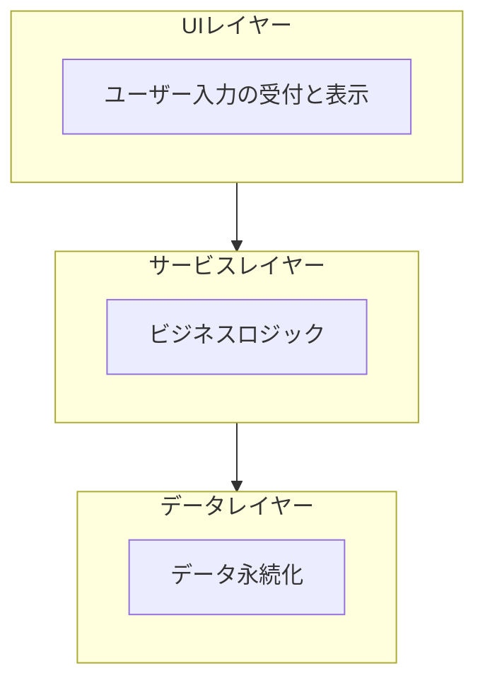

# 技術仕様書 (Architecture Design Document)

## テクノロジースタック

**バージョン方針**: 原則として最新安定版（latest）を使用し、以下に最低要件を記載する。

### 言語・ランタイム

| 技術       | 最低要件          | 選定理由   |
| ---------- | ----------------- | ---------- |
| Node.js    | 20.x 以上 (LTS)   | [理由]     |
| TypeScript | 5.x 以上          | [理由]     |
| npm        | Node.js に同梱    | [理由]     |

### フレームワーク・ライブラリ

| 技術   | 最低要件     | 用途   | 選定理由 |
| ------ | ------------ | ------ | -------- |
| [名称] | [最低要件]   | [用途] | [理由]   |
| [名称] | [最低要件]   | [用途] | [理由]   |

### 開発ツール

| 技術   | 最低要件     | 用途   | 選定理由 |
| ------ | ------------ | ------ | -------- |
| [名称] | [最低要件]   | [用途] | [理由]   |
| [名称] | [最低要件]   | [用途] | [理由]   |

## アーキテクチャパターン

### レイヤードアーキテクチャ

#### UI レイヤー

- **責務**: ユーザー入力の受付、バリデーション、結果の表示
- **許可される操作**: サービスレイヤーの呼び出し
- **禁止される操作**: データレイヤーへの直接アクセス

#### サービスレイヤー

- **責務**: ビジネスロジックの実装、データ変換
- **許可される操作**: データレイヤーの呼び出し
- **禁止される操作**: UI レイヤーへの依存

#### データレイヤー

- **責務**: データの永続化、取得
- **許可される操作**: ファイルシステム、データベースへのアクセス
- **禁止される操作**: ビジネスロジックの実装

## データ永続化戦略

### ストレージ方式

| データ種別 | ストレージ | フォーマット   | 理由   |
| ---------- | ---------- | -------------- | ------ |
| [データ 1] | [方式]     | [フォーマット] | [理由] |
| [データ 2] | [方式]     | [フォーマット] | [理由] |

### バックアップ戦略

- **頻度**: [例: 1 時間ごと]
- **保存先**: [例: `.backup/`ディレクトリ]
- **世代管理**: [例: 最新 5 世代を保持]
- **復元方法**: [手順]

## パフォーマンス要件

### レスポンスタイム

| 操作     | 目標時間 | 測定環境 |
| -------- | -------- | -------- |
| [操作 1] | [時間]   | [環境]   |
| [操作 2] | [時間]   | [環境]   |

### リソース使用量

| リソース | 上限 | 理由   |
| -------- | ---- | ------ |
| メモリ   | [MB] | [理由] |
| CPU      | [%]  | [理由] |
| ディスク | [MB] | [理由] |

## セキュリティアーキテクチャ

### データ保護

- **暗号化**: [対象データと方式]
- **アクセス制御**: [ファイルパーミッション等]
- **機密情報管理**: [環境変数、設定ファイル等]

### 入力検証

- **バリデーション**: [検証項目]
- **サニタイゼーション**: [対象と方法]
- **エラーハンドリング**: [セキュアなエラー表示]

## スケーラビリティ設計

### データ増加への対応

- **想定データ量**: [例: 10,000 件のタスク]
- **パフォーマンス劣化対策**: [方法]
- **アーカイブ戦略**: [古いデータの扱い]

### 機能拡張性

- **プラグインシステム**: [有無と設計]
- **設定のカスタマイズ**: [可能な範囲]
- **API 拡張性**: [将来の拡張方法]

## テスト戦略

### ユニットテスト

- **フレームワーク**: [フレームワーク名]
- **対象**: [テスト対象の説明]
- **カバレッジ目標**: [%]

### 統合テスト

- **方法**: [テスト方法]
- **対象**: [テスト対象の説明]

### E2E テスト

- **ツール**: [ツール名]
- **シナリオ**: [テストシナリオ]

## 技術的制約

### 環境要件

- **OS**: [対応 OS]
- **最小メモリ**: [MB]
- **必要ディスク容量**: [MB]
- **必要な外部依存**: [リスト]

### パフォーマンス制約

- [制約 1]
- [制約 2]

### セキュリティ制約

- [制約 1]
- [制約 2]

## 依存関係管理

**方針**: 原則として latest を使用し、`package-lock.json` で実際のバージョンを管理する。

### 更新ポリシー

| 更新種別               | 対応方針                     |
| ---------------------- | ---------------------------- |
| セキュリティパッチ     | 即時適用                     |
| マイナーアップデート   | 定期的に評価・適用           |
| メジャーアップデート   | 影響を評価し計画的に適用     |
| 破壊的変更リスクあり   | 十分なテスト後に適用         |
